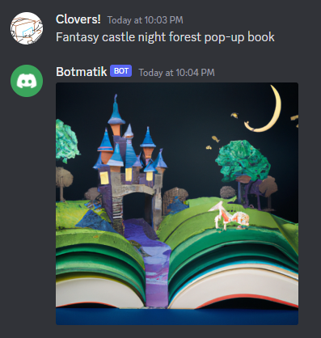

# ai-stuff
This repository contains various AI-related projects and scripts using the OpenAI APIs for text and image generation.

### About OpenAI (As described by ChatGPT)
[OpenAI](https://openai.com/) is an artificial intelligence research laboratory consisting of the for-profit corporation OpenAI LP and its parent company, the non-profit OpenAI Inc. The OpenAI API allows developers to integrate cutting-edge AI models into their applications and products.

## Discord Bot
The `discord-bot-py` folder contains a Python script for a Discord bot that generates images based on user messages using the OpenAI API.



### Prerequisites
You will need to do 3 things to run the bot:
- Install the project's Python requirements.
- Set the Discord and Open AI keys in the config.json file
- Run the bot.

### Installing requirements
Before running the Discord bot, you'll need to install the required Python packages. You can do this using the following command:
```
pip install -r requirements.txt
```

You'll also need to create a `config.json` file in the `discord-bot-py` folder with your Discord bot token and OpenAI API key. Here's an example of what the `config.json` file should look like:

```json
{
    "discord_token": "YOUR_DISCORD_BOT_TOKEN",
    "openai_key": "YOUR_OPENAI_API_KEY"
}
```
### Running the Bot
To run the Discord bot, navigate to the discord-bot-py folder and run the following command:

```
python bot.py
```
The bot will listen for messages in the Discord channel and generate images based on the message content.

### License
This repository is licensed under the MIT License. See the LICENSE file for details.
